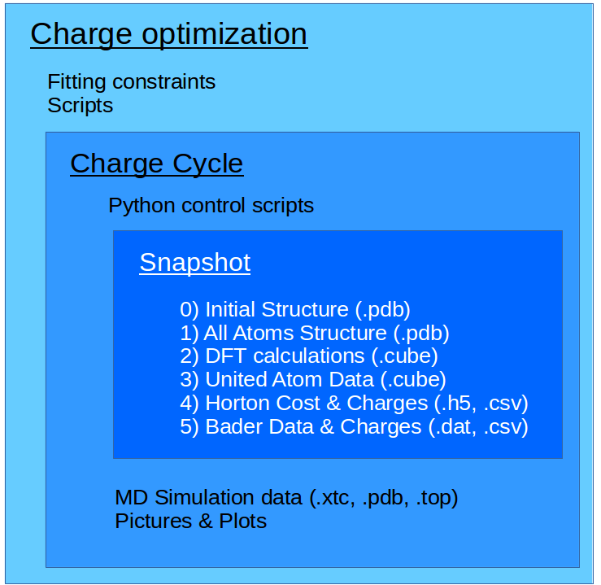

# Sarah Folder Structure
Create a consistent, documented pipline and folder structure for self-consistent MD charge optimization.

### Goal
SMAMP (synthetic mimics of antimicrobial peptides) can be used for antimicrobial coating in medical applications.
To understand a class of SMAMP, we simulate them via Molecular Dynamics (MD).
An essential component of MD are point-charges.
These are not available for the SMAMP molecules of interest, so we have to determine them ourselves.
This repo contains scripts and a folderstructure to automate the calculation of these charges.

### Prerequisites
Make sure you have the smamp module:
1. Local installation
```bash
user@machine:~$ pip install --user smamp
```

2. Module installation
Alternatively, you can install it as a module:
```bash
user@machine:~$ mkdir ~/modulefiles
user@machine:~$ cd ~/modulefiles
user@machine:~$ git clone https://github.com/lukaselflein/smamp; cd smamp
user@machine:~$ echo "#%Module1.0" > ~/modulefiles/smamp
user@machine:~$ echo "prepend-path PYTHONPATH $(pwd)" >> ~/modulefiles/smamp
```

Remember to add it to and load from your modulefiles:
```bash
user@machine:~$ module use ~/modulefiles
user@machine:~$ module load smamp
```
3. Use Lukas' local version
```bash
user@machine:~$ module use /home/fr/fr_fr/fr_le1019/modulefiles
user@machine:~$ module load smamp
```

### Organization
The Project is organized in multiple levels:
1. Highest: This is the current directory. Here, you can put the different self-consistent charge cycles, e.g. the first, second, .. iterations. Also, the folder with the calculation scripts `bin` is located on this level.
2. Charge cycle: Here you will find the administrative scripts, for looping over the actual calculations. Also, the different snapshots are in seperate directories on this level.
3. Snapshot: For every timestamp, a new directory is created. It contains folders for the different steps of the charge optimization workflow.



### Usage Example
If you have done all the prerequisite steps, you can start an automated charge optimization.
#### Create your first charge cycle
```bash
user@machine:~$ cp -r .template_simulation 1_charge_cycle 
user@machine:~$ cd 1_charge_cycle
```
#### Copy MD simulation files
We need the trajectory, etc. in our optimization folderstructure. Copy them into `md_simulation`:
```bash
user@machine:~$ mkdir md_simulation
user@machine:~$ cp PATH_TO_MD_SIMULATION/example.top md_simulation/
user@machine:~$ cp PATH_TO_MD_SIMULATION/example.tpr md_simulation/
user@machine:~$ cp PATH_TO_MD_SIMULATION/example.xtc md_simulation/
user@machine:~$ cp PATH_TO_MD_SIMULATION/example.rtp md_simulation/
```

#### Create the snapshots and subfolder structure
If we want snapshots at time = 100 ps, 200 ps, ... 1000 ps:
```bash
user@machine:~$ module purge
user@machine:~$ module load gromacs/2016.4-gnu-5.2
user@machine:~$ python create_snapshots_from_trajectory.py -tpr md_simulation/example.tpr -top md_simulation/example.top -xtc md_simulation/example.xtc -s 100 -d 100 -e 1000
```

#### Convert UA to AA
```bash
user@machine:~$ module purge
user@machine:~$ module load gromacs/2016.4-gnu-5.2
user@machine:~$ module load matscipy/0.2.0
user@machine:~$ module load smamp
user@machine:~$ python loop_convert_UA_to_AA.py
```

#### Submit gpaw optimization, ESP & Rho job
```bash
user@machine:~$ module purge
user@machine:~$ module load devel/python/3.6.5
user@machine:~$ module load smamp
user@machine:~$ python loop_submit.py
```
Now you will have to wait for the DFT calculations to finish.

### Automation
If you want to automate all of the above steps, you can edit the `preprocessing.sh` script. All the above commands are in there, and you can write your filenames and paths in there.

### Postprocessing
The bash script `postprocessing.sh` should work out of the box, and calculate charges from the converged DFT calculations.
Plots are automatically gereneted in `images`.

### Content
* `Readme.md`: The Readme you are reading right now.
* `bin`: Bash and python scripts for fitting, conversion, extracting, and visualization.
* `preprocessing.sh`: BASH Commands for preprocessing the input up to and including the DFT calculations.
* `postprocessing.sh`: BASH commands to extract densities, calculate and visualize charges.
* `.pictures`: Pictures for the Readme.
* `.simulation_template`: The full template simulation folder structure.
